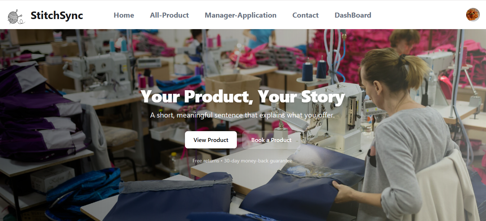

## 📌 Overview
This project helps track garments orders and monitor production status in a simple and organized way.

## 🔗 Live Link
https://garments-order-production.web.app/

## 🖼 Screenshot

## 🛠 Technologies Used
- JavaScript
- HTML
- CSS
- Node JS
- Mongodb
- Express js

## ✨ Features
- Track garments orders
- Monitor production status
- Simple and user-friendly interface

## 📦 Dependencies
- No external dependencies

## ⚙️ How to Run Locally
1. git clone https://github.com/prachi23chowdhury/garments-order-production-tracker-system.git
2. cd REPO-NAME
3. npm install
4. npm run dev
